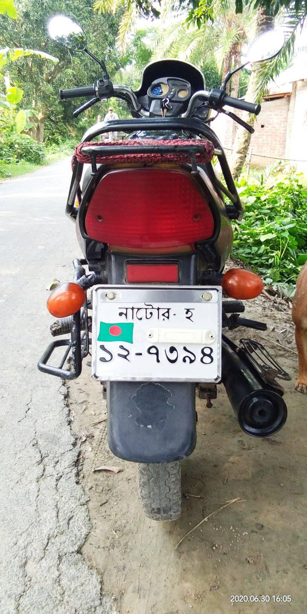
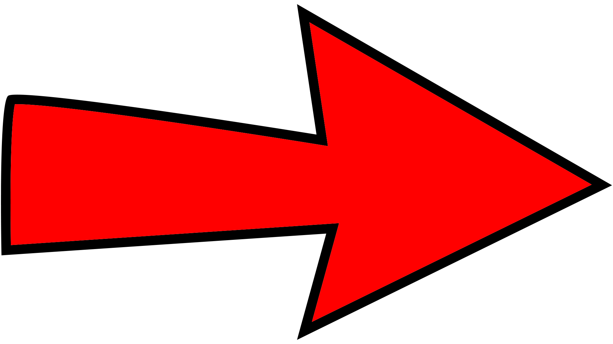
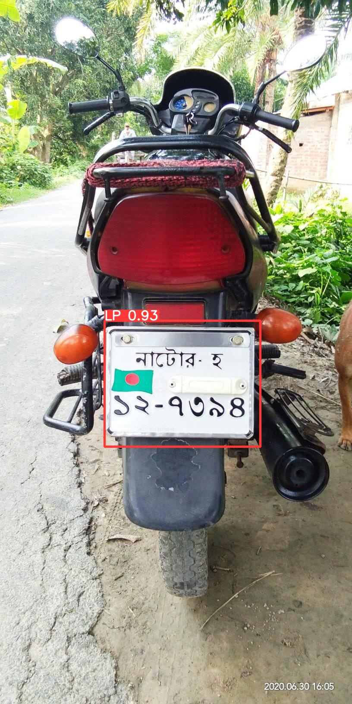
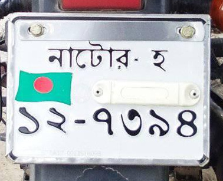
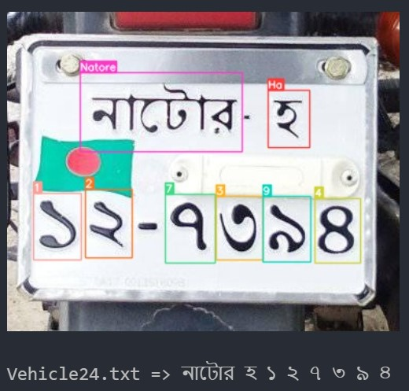

# License Plate Recognition

    

## Description

This project do the following tasks.

1. Detect license plate from vehicle.

    
  
  

2. Cropped the license plate region.

    
  
  

3. Detect the text written on license plate.

    
  
  

## Procedure

In this project there is used two dataset in two phase.

#### Phase 1

- **Input :** Any Bangladeshi vehicle (Bus, Truck, Private Car, Motor Cycle etc.) image from any perspective.
- **Output :** Location and a cropped image of the license plate.

- **Training Metrics :**

#### Phase 2

- **Input :** Cropped image of license plate found in [Phase 1](#phase-1).
- **Output :** License plate number in text format.

- **Training Metrics :**

- **Confusion Metrix :**

## Using Algorithm

YOLO is a fast and efficient object detection algorithm in machine learning that can detect multiple objects in a single forward pass of a CNN.

## Dataset

#### Source

[Bangla LPDB - A](https://zenodo.org/record/4718238)

#### Description

Bangla LPDB - A is the first complete publicly available dataset of Bangladeshi vehicle images with visible Bangla license plates. The vehicle image dataset consists of almost all types of vehicles present in Bangladesh, excluding army, police, and government vehicles. The images are in JPG, and PNG format.

This dataset is of two parts-

1. Bangladeshi vehicle images with visible Bangla license plates which includes 1928 images.

2. Cropped Bangla license plate which includes 2662 images (720 synthetic images, 1942 images manually cropped from part-1).

Each image also contains its corresponding annotated text file in YOLO format. For Part-1 and Part-2, number of classes are 1 and 102, respectively.
*~[Copied from source webpage]~*

## Comparison

We try to meet the success rate as well as [this](https://www.researchgate.net/publication/352672241_Bangla_License_Plate_Detection_Recognition_and_Authentication_with_Morphological_Process_and_Template_Matching) paper.

| Stages             | Success Rate | Our Model |
| ------------------ | ------------ | --------- |
| Number Plate Detection | 94%      | 98%       |
| Character Recognition  | 96%      | 90%       |
| Overall Accuracy       | 96.7%    | 94%       |

## Guideline to Run the Project

There are two section of this project. One is *Train* section and other is *Test* section. As the dataset is not public, you can't run the train section. But you can run the Test section by following task.

- Place the vehicle images in [test folder](./test/).
- Open [this](./License_Plate_Recognition_test.ipynb) file and run all.
- It takes a couple of seconds and produce the ouput in `output` folder.

## Credit

  
  

